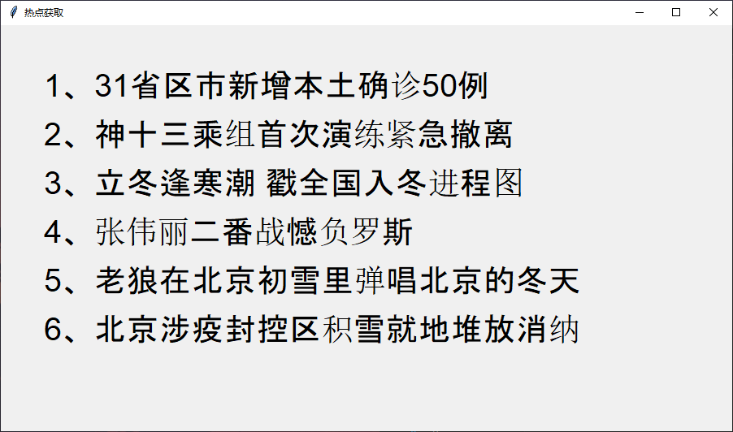

# 热点获取

> 使用python爬虫获取近期热点





## 🔧技术栈

- 语言：python
- 库
    - requests（发送网络请求） `requests.get(url)`
    - bs4（解析，遍历，维护"标签树"）`BeautifulSoup(response.text,'lxml')`
    - tkinter（显示画面） `window = tk.Tk()`
- 爬虫 


## 目录结构

```python
├─.idea
│  └─inspectionProfiles
└─assets
└─index.exe   #可执行文件
└─index.py
└─README.md
```


## ✨特性

- 🌈界面简洁，清爽，没有多余的东西
- 📦非常遍历地获取近期发生的热点
- 🛡项目完整，结构清晰
- ⚙️项目轻量
- ⭐ 规范的结构


## ⭐目的/作用

> 方便用户了解最新的热点


## 🔥代码展示


### 导入模块

```python
import requests
from bs4 import BeautifulSoup
import tkinter as tk
```


### 获取热点数据

```python
def getHotMessage():
    url = 'http://www.baidu.com/'
    headers = {'User-Agent': 'Mozilla/5.0 (Windows NT 10.0; WOW64) AppleWebKit/537.36 (KHTML, like Gecko) Chrome/56.0.2924.87 Safari/537.36'}

    response = requests.get(url,headers = headers) #发送网络请求

    soup = BeautifulSoup(response.text,'lxml')
    listResult = soup.select('span.title-content-title')

    messageList = []  #用来存储获取的热点数据

    for i in listResult:
        messageList.append(str(i).split('<span class="title-content-title">')[1].split('</span>')[0])
    return messageList
```


### 展示热点数据

```python
def show():
    global window
    window = tk.Tk()
    window.title('热点获取')
    window.geometry('900x500')

    messages = getHotMessage()  #调用getHotMessage()方法获取热点数据
    x = 50
    y = 50
    index = 1
    for m in messages:
        textLabel = tk.Label(window,text = str(index) + '、' + m,font = ('Arial',29),foreground = 'black',compound = 'center')
        textLabel.place(x = x,y = y)
        y += 60
        index += 1

    window.mainloop()
```


### 调用展示方法

```python
show()
```

